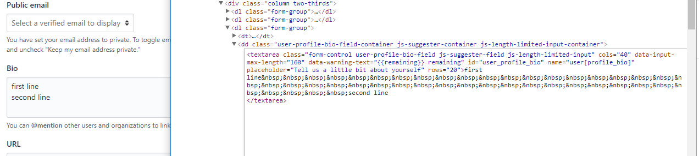

# How to create newline in Github Bio

Here a way to create newline in Github Bio

### Step 1

Open your profile setting page, typing something your want to show in Bio area.

### Step 2

Press F12 to open Developer Tools, select to Bio textarea element, right click on it and select [Edit as HTML], fill enough `&nbsp;&nbsp;&nbsp;&nbsp;&nbsp;&nbsp;&nbsp;&nbsp;&nbsp;&nbsp;&nbsp;&nbsp;` where you want to wrap. place a space at the beginning of the second line if needed.

### Step 3

Return to the setting page and update your profile, it should be fine now.

### Reference

[Correct syntax for newline in Github Bio - stackoverflow](https://stackoverflow.com/questions/43406317/correct-syntax-for-newline-in-github-bio)